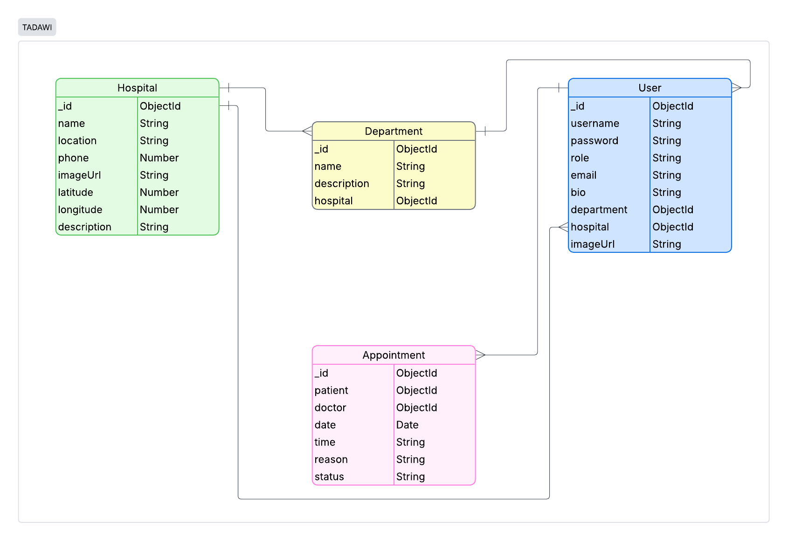

<br>
<div align="center">
<a href="https://git.io/typing-svg"></a>

</div>


<br>
<br>


<div align="center">


  
  
  
  


  
  
  

</div>

<br>
<br>

## Overview

TADAWI is an Arabic word that means treating medically. It is a healthcare web application designed to make finding and booking medical appointments in Bahrain easier.

The platform brings hospitals, clinics, departments, and doctors together in one place, allowing patients to explore healthcare options, find suitable doctors, and book and manage their appointments easily. Doctors can view and manage their assigned appointments, while administrators manage the hospitals, departments, doctors, and other information available on the platform.


<br>
<br>


## Getting Started
1. Clone the repository and navigate into the project folder:
```bash
git clone https://github.com/ruqayaahabib/Tadawi

cd Tadawi
```


2. Create a `.env` file with the following values:

```
MONGODB_URI=your-mongo-db-connection-string
SESSION_SECRET=your-secret-key
PORT=3000
```

3. Install the required dependencies:

```
npm i
```


<br>
<br>

## User Stories
1. As a patient, I want to sign up, sign in, and sign out.
2. As a patient or guest, I want to browse hospitals and view their details.
3. As a patient, I want to view departments and doctors within a hospital.
4. As a patient, I want to search for doctors.
5. As a patient, I want to book an appointment with a doctor.
6. As a patient, I want to view, reschedule, and cancel my appointments.

7. As a doctor, I want to view my assigned and upcoming appointments.
8. As a doctor, I want to update appointment status to confirmed, declined, or completed.

9. As an admin, I want to view system statistics through the admin dashboard.
10. As an admin, I want to add, edit, and delete hospitals, departments, and doctors

<br>
<br>

## Database Design



<br>
<br>

## Routes

### General

| Method | Route | Description |
|--------|-------|-------------|
| GET | `/` | Home page |

### Authentication

| Method | Route | Description |
|--------|-------|-------------|
| GET | `/auth/sign-up` | Sign-up form |
| POST | `/auth/sign-up` | Create patient account |
| GET | `/auth/sign-in` | Sign-in form |
| POST | `/auth/sign-in` | Log user in |
| GET | `/auth/sign-out` | Log user out |

### Hospitals

| Method | Route | Description |
|--------|-------|-------------|
| GET | `/hospitals` | View all hospitals |
| GET | `/hospitals/:hospitalId` | View hospital details |

### Departments

| Method | Route | Description |
|--------|-------|-------------|
| GET | `/departments/:departmentId` | View department and its doctors |

### Patient Appointments

| Method | Route | Description |
|--------|-------|-------------|
| GET | `/appointments` | View patient's appointments |
| GET | `/appointments/new/:doctorId` | Appointment booking form |
| POST | `/appointments/:doctorId` | Book an appointment with a doctor |
| GET | `/appointments/:appointmentId` | View appointment details |
| GET | `/appointments/:appointmentId/edit` | Edit appointment form |
| PUT | `/appointments/:appointmentId` | Update appointment |
| DELETE | `/appointments/:appointmentId` | Cancel appointment |

### Doctor

| Method | Route | Description |
|--------|-------|-------------|
| GET | `/doctor` | View doctor dashboard |
| GET | `/doctor/appointments` | View doctor's assigned appointments |
| GET | `/doctor/appointments/:appointmentId` | View appointment details |
| PUT | `/doctor/appointments/:appointmentId` | Update appointment status |

### Admin Dashboard

| Method | Route | Description |
|--------|-------|-------------|
| GET | `/admin` | View admin dashboard |

### Admin - Hospitals

| Method | Route | Description |
|--------|-------|-------------|
| GET | `/admin/hospitals` | View all hospitals |
| GET | `/admin/hospitals/new` | Add hospital form |
| POST | `/admin/hospitals` | Add a new hospital |
| GET | `/admin/hospitals/:hospitalId/edit` | Edit hospital form |
| PUT | `/admin/hospitals/:hospitalId` | Update hospital |
| DELETE | `/admin/hospitals/:hospitalId` | Delete hospital |

### Admin - Departments

| Method | Route | Description |
|--------|-------|-------------|
| GET | `/admin/departments` | View all departments |
| GET | `/admin/departments/new` | Add department form |
| POST | `/admin/departments` | Add a new department |
| GET | `/admin/departments/:departmentId/edit` | Edit department form |
| PUT | `/admin/departments/:departmentId` | Update department |
| DELETE | `/admin/departments/:departmentId` | Delete department |
| GET | `/admin/departments/get-hospital/:hospital` | Get departments for selected hospital |

### Admin - Doctors

| Method | Route | Description |
|--------|-------|-------------|
| GET | `/admin/doctors` | View doctors |
| GET | `/admin/doctors/new` | Add doctor form |
| POST | `/admin/doctors` | Add a new doctor |
| GET | `/admin/doctors/:doctorId/edit` | Edit doctor form |
| PUT | `/admin/doctors/:doctorId` | Update doctor |
| DELETE | `/admin/doctors/:doctorId` | Delete doctor |

<br>
<br>

## Features

- **User Authentication** – Users can sign up, sign in, and sign out securely.

- **Role Management** – Supports Patient, Doctor, and Admin roles with different permissions and protected routes.

- **Appointment Booking and Management** – Patients can book, view, reschedule, and cancel appointments, while doctors can update appointment status.

- **Role-Based Dashboards** – Dedicated dashboards and interfaces for Patients, Doctors, and Admins based on their responsibilities.

- **Admin Chart and Statistics** – Admin dashboard provides system statistics and a chart showing users by role.

- **Healthcare Management** – Admins can add, edit, and delete hospitals, departments, and doctors.

- **Doctor Search** – Patients can search for doctors to find healthcare providers more easily.

- **Interactive Maps** – Leaflet maps display hospital locations directly within the platform.

- **Photo Uploads** – Multer is used to upload and manage images for hospitals and doctors.

- **Notifications and Confirmations** – Toast notifications provide action feedback, with confirmation alerts for delete actions.

- **Responsive Interface** – Bootstrap and custom CSS are used to create a responsive and consistent user interface.


<br>
<br>

## Future Enhancements
- External API Integration
- Email Confirmations using Nodemailer
- Export Reports to Excel or PDF
- Appointment Reminders
- Doctor Availability and Time Slots
- Patient Reviews and Ratings


<br>
<br>

## Credits

- [Leaflet](https://leafletjs.com/) – Interactive hospital maps
- [Bootstrap](https://getbootstrap.com/) – CSS library
- [Bootstrap Icons](https://icons.getbootstrap.com/) – Interface icons
- [SweetAlert2](https://sweetalert2.github.io/) – Delete confirmation alerts
- [Toastify JS](https://apvarun.github.io/toastify-js/) – Toast notifications
- [Multer](https://www.npmjs.com/package/multer) – Image uploads
- [Chart.js](https://www.chartjs.org/) – Admin dashboard chart


## References

1. **Map Functionality**
   - [Leaflet Quick Start Guide](https://leafletjs.com/examples/quick-start/)
   - [Allow Decimal Places in Number Input](https://stackoverflow.com/questions/34057595/allow-2-decimal-places-in-input-type-number)
   - [Move Marker on Click](https://stackoverflow.com/questions/65793398/move-marker-on-click)
   - [Add Marker on Click in Leaflet](https://stackoverflow.com/questions/52357091/how-to-add-marker-on-click-event-in-leaflet-js)

2. **Delete Confirmation**
   - [SweetAlert Delete Confirmation](https://stackoverflow.com/questions/46034634/sweet-alert-confirmation-before-delete)

3. **Doctor Search**
   - [MongoDB Search with Express](https://stackoverflow.com/questions/57744116/nodejs-mongodb-cant-send-a-parameter-using-a-form-to-be-later-used-in-a-mon)
   - [Search Bar GET Request using Express](https://stackoverflow.com/questions/65067626/search-bar-get-request-using-express)

4. **Department Filtering by Hospital**
   - [Using the Fetch API](https://developer.mozilla.org/en-US/docs/Web/API/Fetch_API/Using_Fetch)

5. **Bootstrap Setup**
   - [Using Bootstrap with Express](https://stackoverflow.com/questions/30473993/how-to-use-npm-installed-bootstrap-in-express)

6. **Doctor Upcoming Appointments**
   - [Sorting with MongoDB and Mongoose](https://stackoverflow.com/questions/52922390/sorting-infinite-scroll-with-mongo-and-mongoose)

7. **Selected Option on Update**
   - [Update Selected Option with EJS](https://stackoverflow.com/questions/65674796/how-do-i-update-which-option-is-selected-based-on-ejs)

8. **Session and Redirect Handling**
   - [Express Session Redirect](https://stackoverflow.com/questions/35182771/express-session-why-is-redirect-executed-before-my-session-info-is-set)
   - [Session Destroy and Redirect](https://stackoverflow.com/questions/59916129/node-js-session-destroy-does-not-redirect)


<br>
<br>

